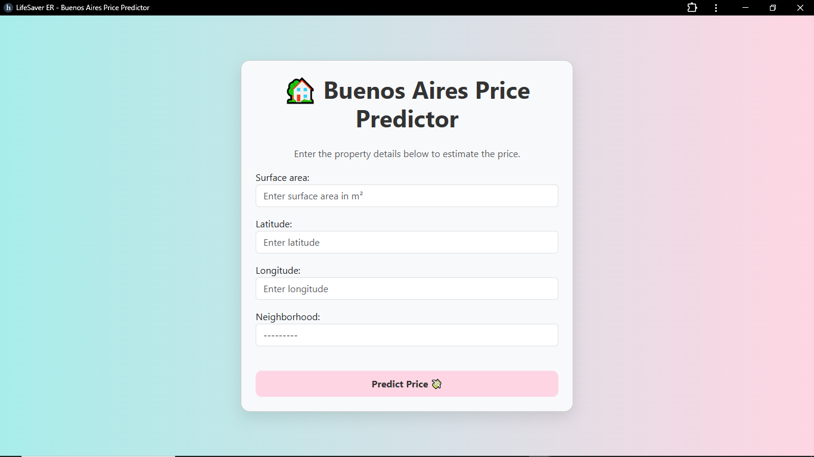

---

# 🏡 Buenos Aires Apartment Price Predictor

This project is a web application built with **Django** and **scikit-learn** that allows users to estimate apartment prices in Buenos Aires based on key property features like surface area, location (latitude and longitude), and neighborhood.

## 🚀 Features

- ✅ Predicts apartment prices in Capital Federal, Buenos Aires
- ✅ User-friendly web interface with Bootstrap styling
- ✅ Handles data preprocessing and outlier removal
- ✅ Machine Learning model built with Ridge Regression
- ✅ 57 neighborhoods included


## 📊 Data

- Dataset: Real estate listings from Buenos Aires (multiple CSVs)
- Filtered to only include:
  - Apartments (`property_type == "apartment"`)
  - Properties in Capital Federal
  - Reasonable price range (≤ $500,000)
- Dropped high-cardinality and highly correlated features
- Removed outliers based on surface area

---

## 🧠 Model

- **Ridge Regression** model
- Categorical feature: `neighbourhood` (encoded using OneHotEncoder)
- Pipeline includes:
  - OneHotEncoding
  - Imputation (SimpleImputer)
  - Ridge regression fitting

---

## 🖥️ Web App Functionality

Users can input:
- Surface area (in m²)
- Latitude
- Longitude
- Neighborhood (from dropdown)

App returns:
- Estimated price in USD
- Price formatted with commas (e.g., `$95,300`)

---

## ⚙️ How to Run on your local machine

1. **Clone this repo**
```bash
git clone https://github.com/sodiqlef/Buenos-aires-house-price-prediction.git
cd prediction
```

2. **Install dependencies**
```bash
pip install -r requirements.txt
```

3. **Run Django server**
```bash
python manage.py runserver
```

4. **Visit in browser**
```
http://127.0.0.1:8000/
```

---

## ⚙️ How to Run on web

1. **Visit the web address**
```
http://devsodiq-buenos-aires.herokuapp.com/
```

---

## 🧾 Requirements

- Python 3.8+
- Django 4.x
- scikit-learn
- pandas
- category_encoders
- seaborn 

Install via:

```bash
pip install django scikit-learn pandas category_encoders seaborn
```

---

## 📸 UI Screenshot



---

## 📌 To Do

- Add map-based location input (for lat/lon)
- Allow CSV upload to predict bulk prices
- Add price range confidence interval

---


